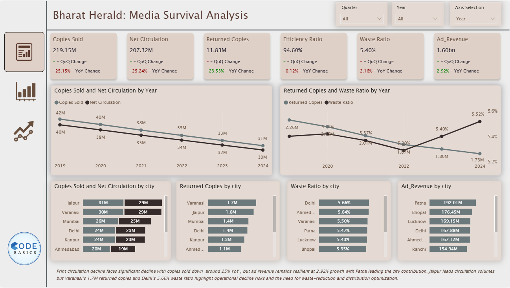
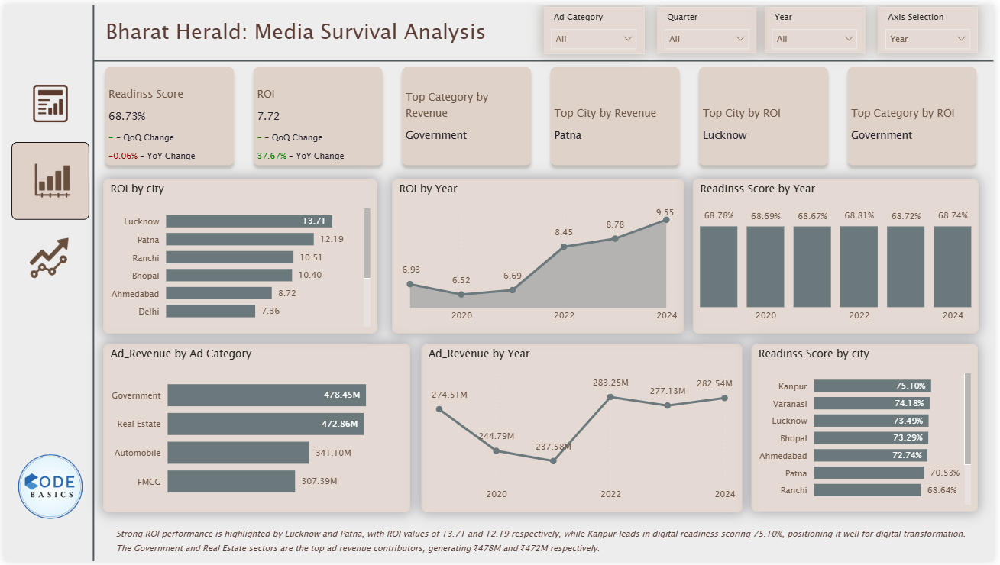
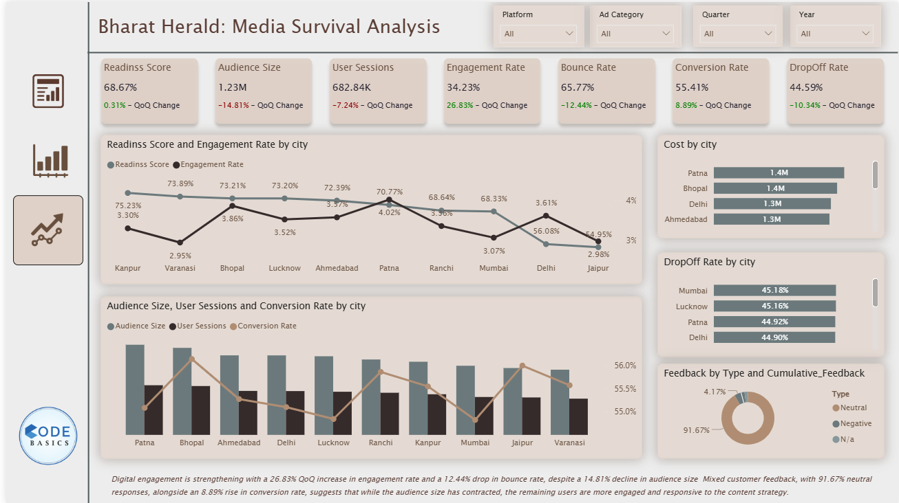

Page 1:
This section focuses on print circulation data, tracking copies sold, returns, and waste ratios to understand operational efficiency and declining print trends.

page 2:
This page shows key performance indicators and advertising metrics across cities and years, helping identify top-performing regions and revenue drivers.

page 3:
This page analyzes the performance of the 2021 e-paper pilot. It provides insights into user interaction, adoption readiness, and the effectiveness of the campaign in engaging and converting users across various cities.

